# Tareas_SO1_S2_2025
Navegacion de directorios: cd, ls, pwd
## pwd - muestra el directorio actual
Pwd

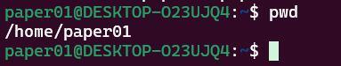 
## ls - lista el contenido del directorio
Ls 

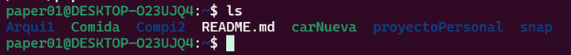
## cd - cambiar de directorio
Cd

 
## touch - crear archivos vacíos

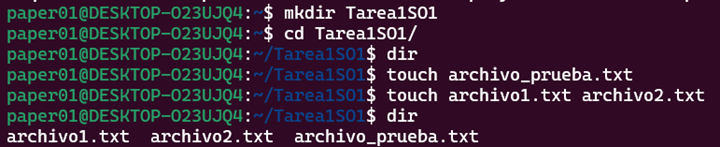 
## cp - copiar archivos

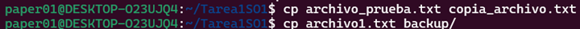 

## mv - mover/renombrar archivos

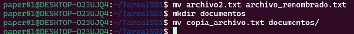 

## rm - eliminar archivos

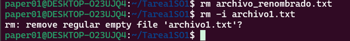 

Visualización de contenido
## cat - mostrar todo el contenido

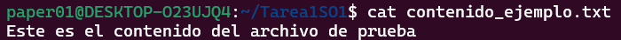 

## more - mostrar contenido página por página

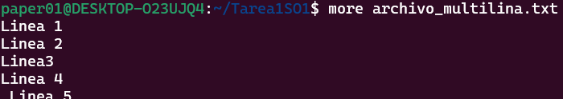 
## less - navegador de contenido más avanzado

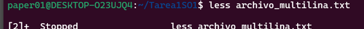 

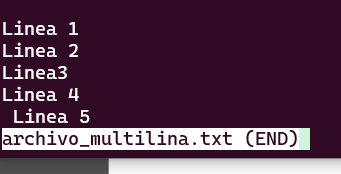 

# Gestión de permisos
## chmod - cambiar permisos de archivos
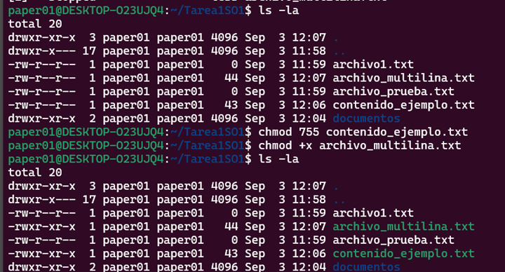

## Script 
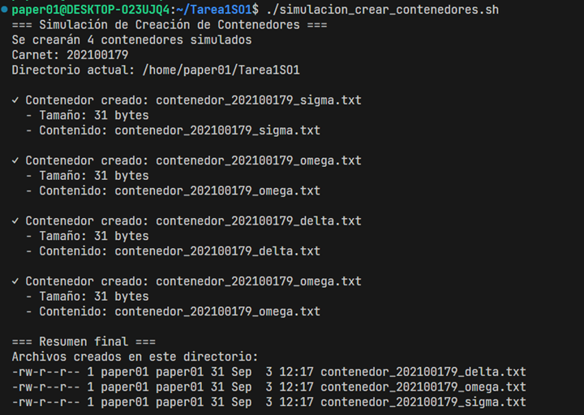